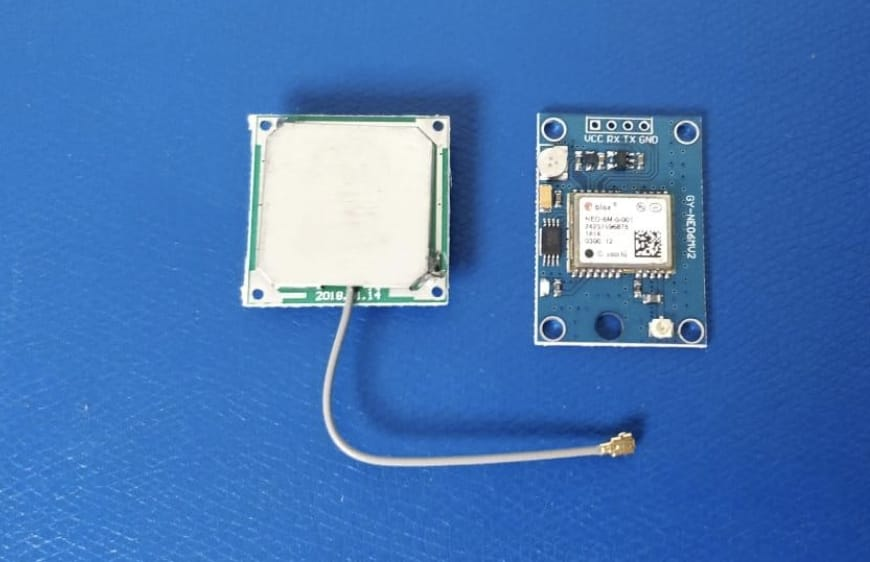
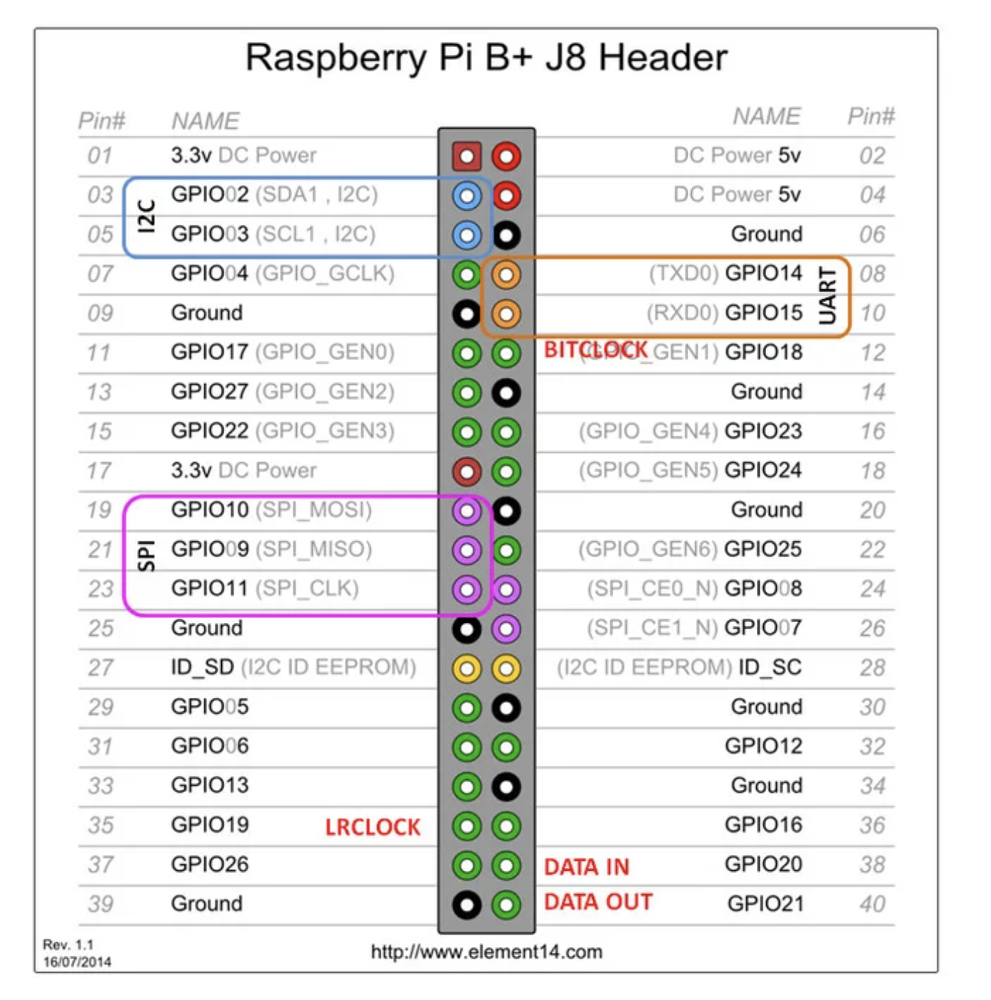

NEO-6M GPS Module with EPROM is a complete GPS module that is based on the NEO 6M GPS. This unit uses the latest technology to give the best possible positioning information and includes a larger built-in 25 x 25mm active GPS antenna with a UART TTL socket. A battery is also included so that you can obtain a GPS lock faster. This is an updated GPS module that can be used with ardupilot mega v2. This GPS module gives the best possible position information, allowing for better performance with your Ardupilot or other Multirotor control platform.

The GPS module has serial TTL output, it has four pins: TX, RX, VCC, and GND. You can download the u-centre software for configuring the GPS and changing the settings and much more. It is really good software (see link below).


## Intent

How to connect GPS to Raspberry Pi or Arduino and fetch the latitude and longitude values

## Hardware Requirement

- NEO-6M GPS Module with EPROM



- Raspberry Pi / Arduino

The first step is to connect the GPS module to the Raspberry PI. There are only 4 wires (F to F), so it's a simple connection.



- Neo-6M RPI

- VCC to Pin 1, which is 3.3v

- TX to Pin 10, which is RX (GPIO15)

- RX to Pin 8, Which is TX (GPIO14)

- Gnd to Pin 6, which is Gnd


##  Turn Off the Serial Console

By default, the Raspberry Pi uses the UART as a serial console. We need to turn off that functionality so that we can use the UART for our own application. Open a terminal session on the Raspberry Pi.

### Step 1. Backup the file cmdline.txt 

```
sudo cp /boot/cmdline.txt /boot/cmdline_backup.txt 
```


### Step 2. Edit cmdlint.txt and remove the serial interface

```sudo nano /boot/cmdline.txt
```


### Step 3. Delete console=ttyAMA0,115200 

Once you delete it, save the file by pressing Ctrl X, Y, and Enter.

### Step 4. Edit /etc/inittab

```
sudo nano /etc/inittab 
```


### Step 5. Find ttyAMA0 

You can find ttyAMA0 by pressing Ctrl W and typing ttyAMA0 on the search line

Press Home > insert a # symbol to comment out that line and Ctrl X, Y, Enter to save.

```
sudo reboot
```


### Step 6. Test the GPS

Open a terminal session and type 

```
sudo apt-get install gpsd gpsd-clients
```


### Step 7. Start the serial port:

```
stty -F /dev/ttyAMA0 9600
```

Now start GPSD:

```
sudo gpsd /dev/ttyAMA0 -F /var/run/gpsd.sock
```

### Step 8. Final Results

```
cgps -s
```


